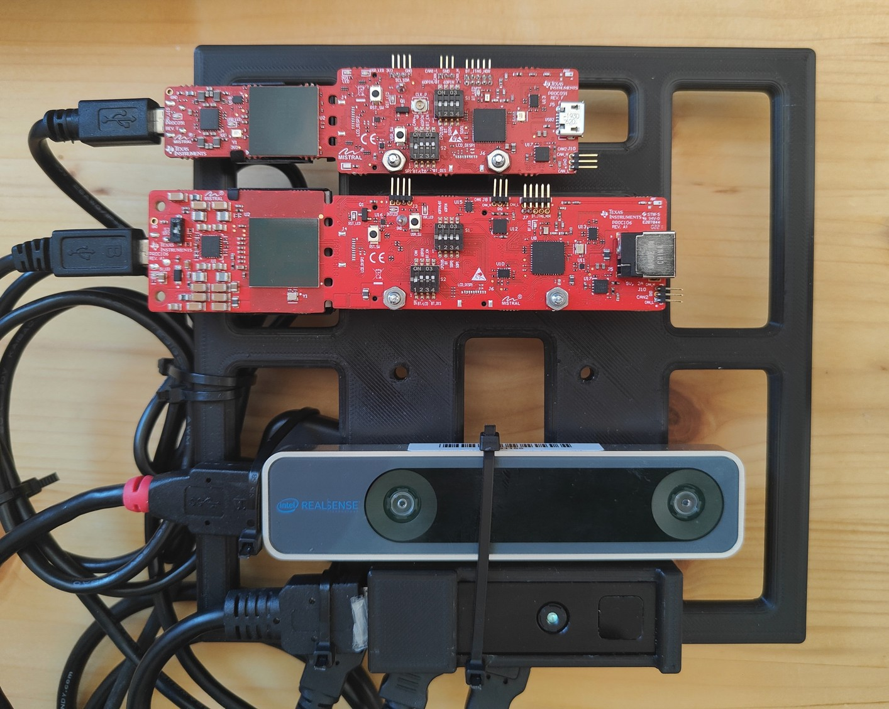
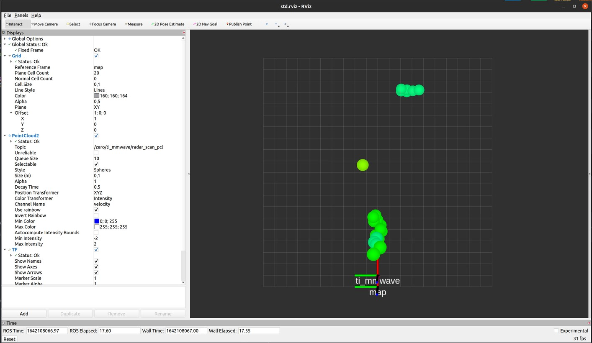

# ROS Driver for TI's mmWave Radars

This package provides a ROS package for TI's mmWave radars.

It is forked from Leo Zhang's [work](https://github.com/radar-lab/ti_mmwave_rospkg), which itself is based on TI's [ROS driver](https://dev.ti.com/tirex/explore/node?node=AJVkbvjyhr4p7F6L5Elt4w__VLyFKFf__LATEST). This fork aims to update and simplify the code, porting it to ROS 2, and make it more accessible for robotic applications with short to medium-range sensing requirements. We believe that this small form-factor antenna on package (AOP) chip design features some unique capabilities thanks to its little weight and low power consumption. The driver for the DCA1000 is based on a [package by moodoki](https://github.com/moodoki/iwr_raw_rosnode/)

## Devices and Software

The package has been tested with the following setups:

* Devices
  * AWR 1843AOP evaluation module
  * DCA1000 
* Software (Ubuntu / ROS)
  * 20.04 / Galactic
* SDK version: 3.5

The devices typically come with the out-of-box demo preinstalled, so most likely, you don't need to flash the evaluation module. If your sensors don't match with the SDK version (3.5), consider re-flashing them according to [this](https://dev.ti.com/tirex/explore/content/mmwave_industrial_toolbox_4_10_0/labs/Robotics/ros_driver/docs/TI_mmWave_ROS_Driver_Users_Guide.html#how-do-i-re-flash-the-ti-mmwave-evm-with-out-of-box-demo-) guide.

## Getting Started



Preliminary steps:

1. Connect the micro-USB (the one closer to the antenna) of the AOP sensor to the host machine running ROS.
2. On Linux, make sure you have the right permissions to access the serial port:
```
sudo usermod -aG dialout $USER
```
3. Test your sensor with the [Demo Visualizer](https://dev.ti.com/gallery/view/mmwave/mmWave_Demo_Visualizer/ver/3.5.0/) to check the connectivity and basic functionality. You can also create your own configuration file for your use-case (fps, range, velocity, etc.) with the visualizer.
4. Connect the DCA1000 EVM ethernet port to an ethernet port on the host machine. (This also works with ethernet to USB converters)

Clone, build and launch:

5. Clone this repo and ROS serial onto your `<workspace dir>/src`:

  ```shell
  git clone https://github.com/Plaba/ti_mmwave_ros2.git
  git clone https://github.com/Plaba/serial-ros2.git
  ```
  
6. Go back to `<workspace dir>`, then build and source:

  ```shell
  colcon build --symlink-install
  source install/setup.bash
  ```

7. Fire up the launch file:

  ```shell
  ros2 launch ti_mmwave ti_radar.launch.py
  ```

  ~~Note: If you set `visualize` to `True`, then rviz should start and you should see something like the following: ~~ TODO update

  
  
8. ROS topics can be accessed as follows:
  ```shell
  ros2 topic list
  ros2 topic echo /ti_mmwave/radar_scan_pcl
  ros2 topic echo /ti_mmwave/raw_data
  ```
  
## Message format

The `radar_scan_pcl` is a customized point cloud topic, consisting of:

* location (x, y, z) in [m]
* radial range in [m]
* radial velocity in [m/s]
* intensity in [dB]
* noise [dB] // todo: add to driver

## Troubleshooting

1. Insufficient rights on ports:

  ```
  mmWaveCommSrv: Failed to open User serial port with error: IO Exception (13): Permission denied
  mmWaveCommSrv: Waiting 20 seconds before trying again...
  ```

  This happens when the serial port is called without superuser permission. Do the following steps:
  ```
  sudo usermod -aG dialout $USER
  ```
  restart your shell and try again.

2. Sensor hiccup:

  ```
  mmWaveQuickConfig: Command failed (mmWave sensor did not respond with 'Done')
  mmWaveQuickConfig: Response: 'sensorStop
  '?`????`????`???~' is not recognized as a CLI command
  mmwDemo:/>'
  ```

  When this happens, re-run the command you send to the sensor. If it continues, shut down and restart the sensor.
3. DCA1000 configures correctly but no data is sent:

  Make sure the xWR1xxx is in debug mode, and switch 2.5 on the DCA1000 is set to SW_CONFIG. [Source](https://www.ti.com/lit/ug/spruij4a/spruij4a.pdf)


## Multiple devices support (todo: update this!)

Preparation:

* If you use multiple sensors, enable the additional ports, e.g. `/dev/ttyUSB2` and `/dev/ttyUSB3`, etc. accordingly.
* A better way to deal with multiple sensors is setting up your own udev-rule. Something along the following lines:
  * Gather the required information:
    * for idVendor:idProduct: `lsusb` => 10c4:ea70
    * for serial: `udevadm info -a /dev/ttyUSB0 | grep serial` => 00DEEBD8
    * for DEVPATH: `udevadm info /dev/ttyUSB0` => /devices/pci0000:00/0000:00:14.0/usb1/1-6/1-6:1.0/ttyUSB0/tty/ttyUSB0
  * Then, go to `/etc/udev/rules.d` and create the udev-rule: `sudo gedit 99-usb-serial.rules` with the data from above:

    ```shell
    SUBSYSTEM=="tty", ATTRS{idVendor}=="10c4", ATTRS{idProduct}=="ea70", ATTRS{serial}=="00DEEDA3", DEVPATH=="/devices/pci0000:00/0000:00:14.0/usb1/1-*/1-*:1.0/ttyUSB*/tty/ttyUSB*" SYMLINK+="ttyUSB.6843cli"
    SUBSYSTEM=="tty", ATTRS{idVendor}=="10c4", ATTRS{idProduct}=="ea70", ATTRS{serial}=="00DEEDA3", DEVPATH=="/devices/pci0000:00/0000:00:14.0/usb1/1-*/1-*:1.1/ttyUSB*/tty/ttyUSB*" SYMLINK+="ttyUSB.6843data"

    SUBSYSTEM=="tty", ATTRS{idVendor}=="10c4", ATTRS{idProduct}=="ea70", ATTRS{serial}=="00DEEBD8", DEVPATH=="/devices/pci0000:00/0000:00:14.0/usb1/1-*/1-*:1.0/ttyUSB*/tty/ttyUSB*" SYMLINK+="ttyUSB.1843cli"
    SUBSYSTEM=="tty", ATTRS{idVendor}=="10c4", ATTRS{idProduct}=="ea70", ATTRS{serial}=="00DEEBD8", DEVPATH=="/devices/pci0000:00/0000:00:14.0/usb1/1-*/1-*:1.1/ttyUSB*/tty/ttyUSB*" SYMLINK+="ttyUSB.1843data"
    ```

Old:

1. Connect two devices and try `ll /dev/serial/by-id` or `ls /dev`. In this case, `/dev/ttyACM0` to `/dev/ttyACM3` should shown.
2. To avoid serial port conflict, you need to launch devices separately. So for the first device (it will open rviz):

  ```
  roslaunch xwr_data multi_1642_0.launch 
  ```

3. Change radars' location in first three arguments `<node pkg="tf" type="static_transform_publisher" name="radar_baselink_0" args="0 -1 0 0 0 0 ti_mmwave_pcl ti_mmwave_0 100"/>` (stands for x,y,z for positions) in launch file `multi_1642_1.launch`. And launch second device:

  ```
  roslaunch xwr_data multi_1642_1.launch 
  ```

Note: As serial connection and the original code, you need to launch devices separately using different launch files.

## Camera overlay support (working with USB camera or CV camera) (todo: update this!)

1. Download and build USB camera repo [here](https://github.com/radar-lab/usb_webcam`). And set parameters of camera in `<usb_webcam dir>/launch/usb_webcam.launch`.
2. To test the device image working, try:

  ```
  roslaunch usb_webcam usb_webcam.launch
  rosrun rqt_image_view rqt_image_view  
  ```

3. Make sure you have done [ROS camera calibration](http://wiki.ros.org/camera_calibration) and create a `*.yaml` configuration file accordingly.
4. Launch radar-camera system using:

  ```
  roslaunch xwr_data camera_overlay.launch
  ```

## Changelog

```
v3.5.0
Gerneral overhaul
Focussing on 1843AOP and 6843AOP

v3.3.0
Add support for XWR18XX devices. SDK version: 3.2.0.4.

v3.2.2
Fix bugs and update README.

v3.2.1
Support camera overlay over 3D 1443s.

v3.2.0
Added camera overlay support.

v3.1.0
Strengthened code.

v3.0.0
Added README.
Improved rviz looking for point cloud data.
Added support for multiple radars working together. 
Improved radar's all around working conditions.

v2.0.0
Added support for ES2.0 EVM devices.

v1.0.0
Added Doppler from TI's mmWave radars.
```
